# 水稻病虫害自动识别系统

## 介绍

本识别项目通过对于用户所上传的水稻图片进行分析，识别出相应的病虫害，通过这种方法帮助种植用户进行虫害的识别

## 技术栈

| 开发语言 | python，java                      |
| -------- | :-------------------------------- |
| 前端     | layui,thymeleaf                   |
| 后端     | java,flask                        |
| 数据库   | Mysql                             |
| 机器学习 | TensorFlow2.0                     |
| 服务器   | Centos（腾讯云）+Ubuntu（阿里云） |

## 项目结构

JavaWeb项目：

​	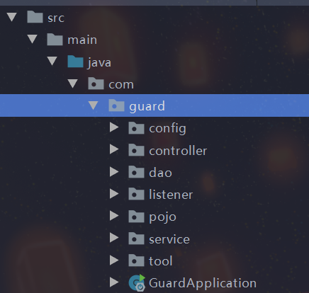

js/css+静态页面

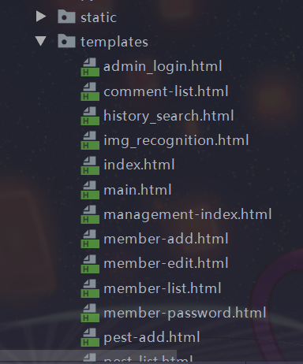

为了方便起见，python写的flask项目直接丢的在resource内

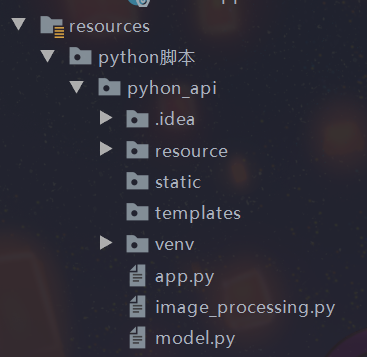

## 使用方式

1. 修改controller类中UploadController中的路径（修改为本地存储路径，虽然最后会删除，所以不占地方）

   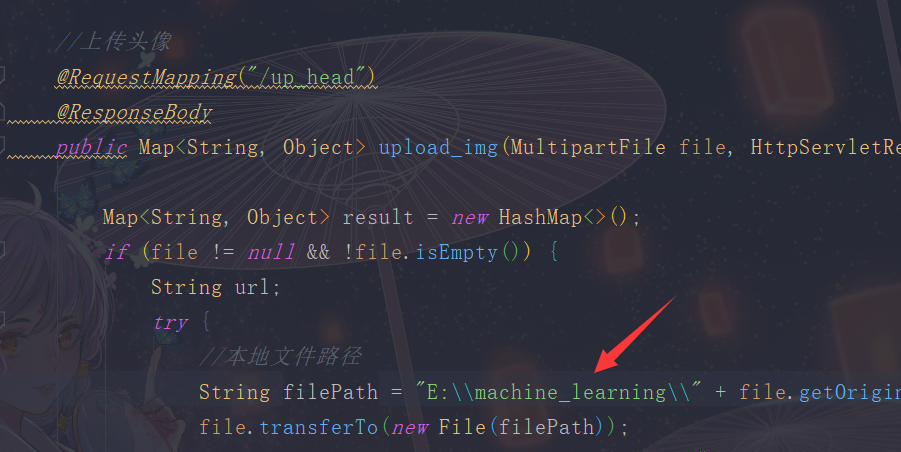

   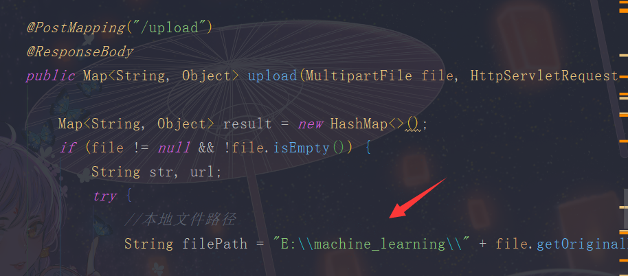

2. 修改application.properties配置文件中的mysql配置

   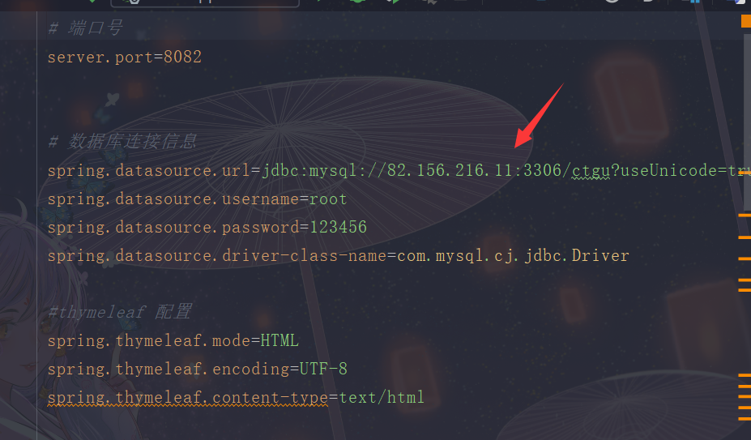

3. 修改tool内中的接口

   由于这个预测接口被我放在了服务器上，所以需要修改成自己的才可以

   详细原理介绍可以看我写的博客

   https://www.cnblogs.com/printwangzhe/p/15087444.html

   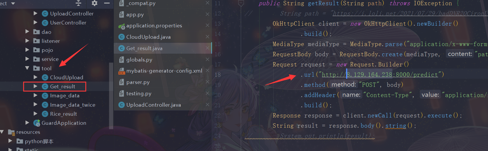

## 功能介绍

### 1.病虫害识别

#### 图片上传

#### 图片识别

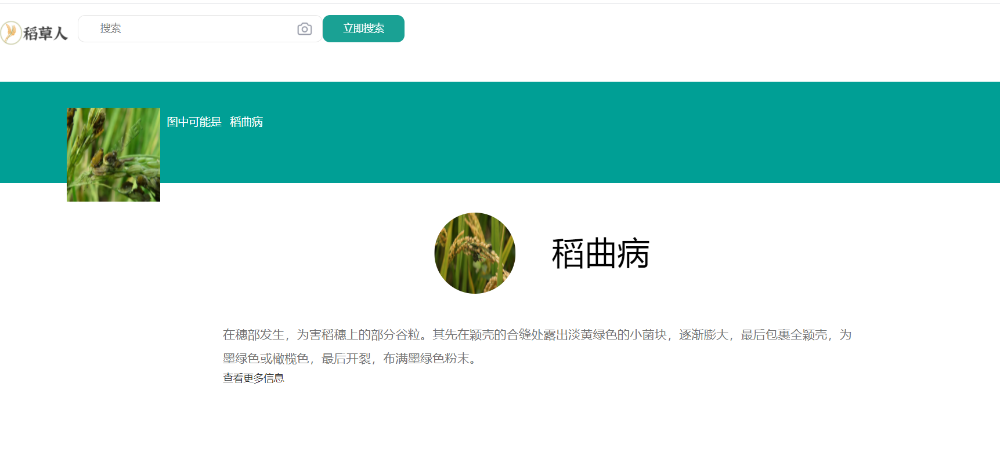

### 2.用户登录注册

#### 用户登录

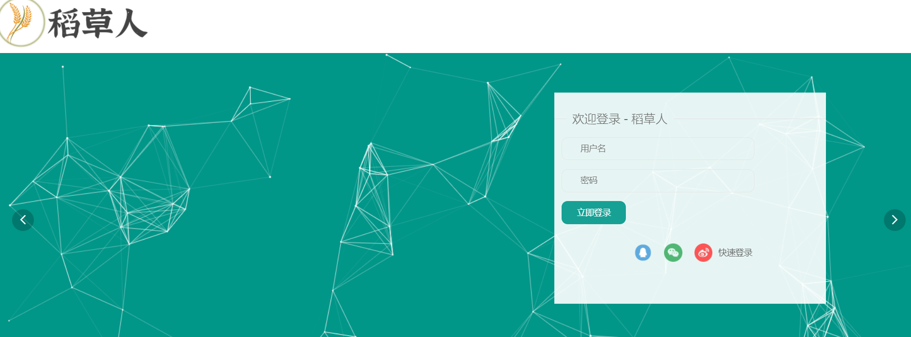

#### 用户注册

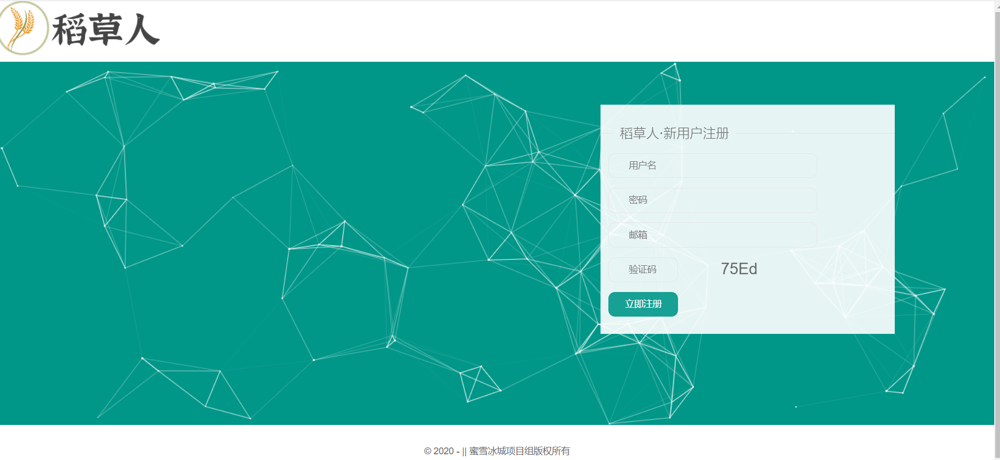

### 3.病虫害百科查询

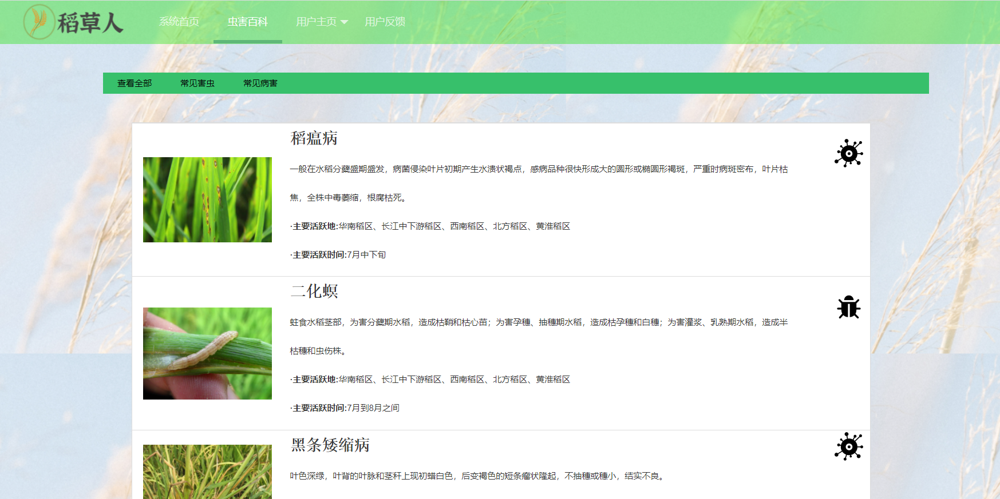

### 4.系统首页

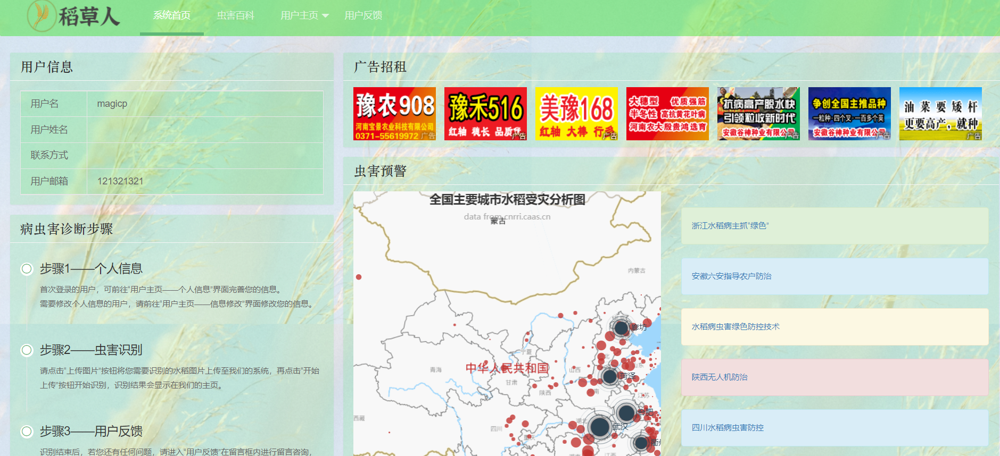

### 5.用户反馈

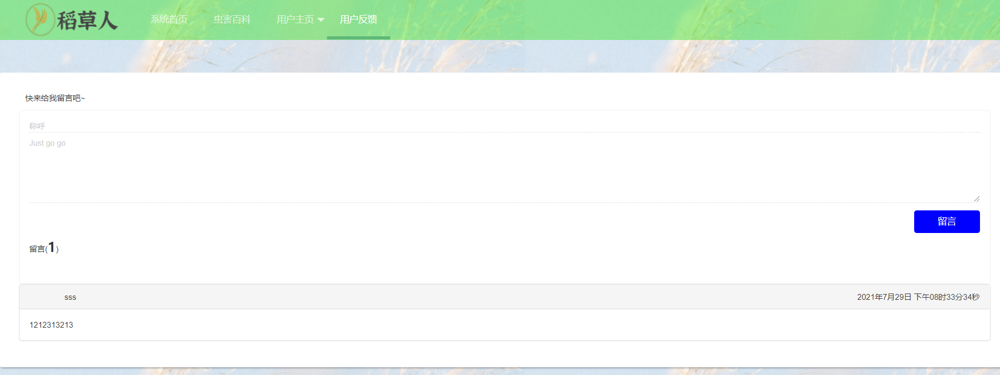

### 6.用户搜索历史

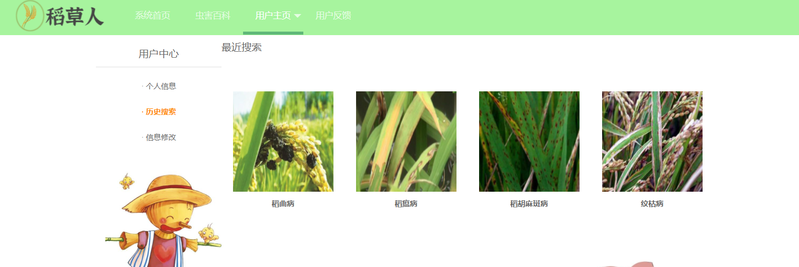

### 7.用户中心

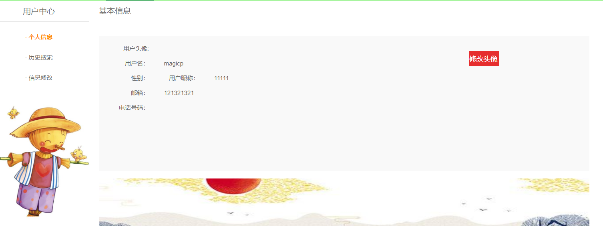

### 8.用户管理--后台

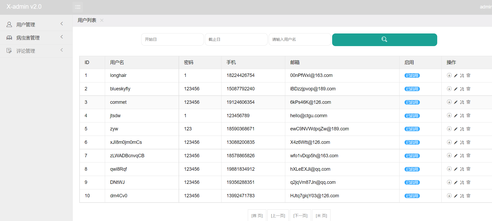

### 9.病虫害管理--后台

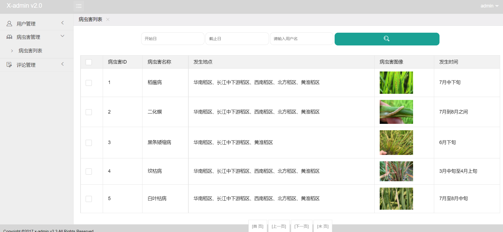

### 10.评论管理--后台

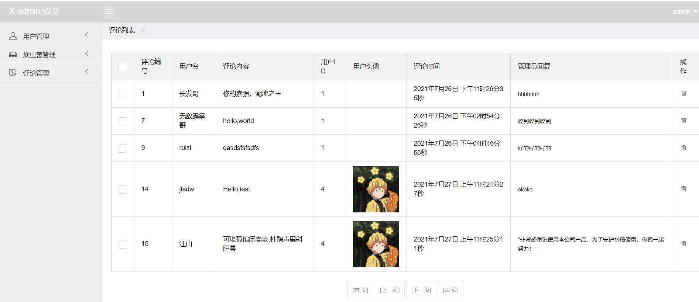

## 项目中的用户

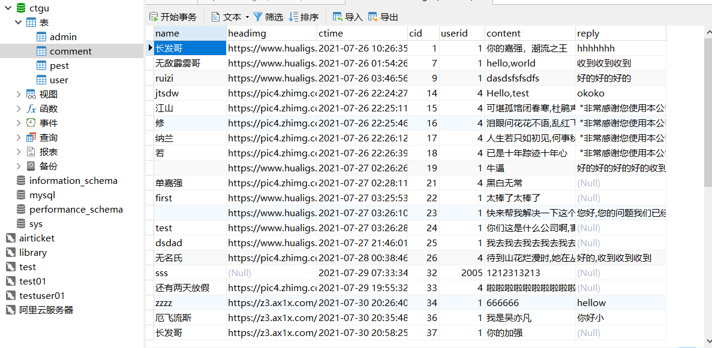

### 1.管理员

管理员为系统的维护者，能够对数据库进行增删改等操作

### 2.客服

客服能够对问题进行回复

### 3.普通用户

一般注册后的用户都是普通用户

### 4.游客

未经注册的用户

## 项目亮点

### 1.图像识别率高

训练后的识别准确率可以达到93%左右

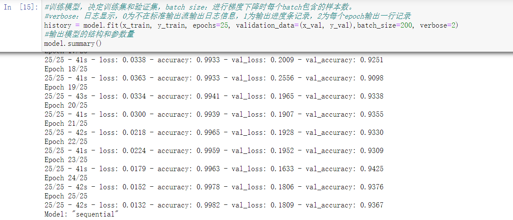

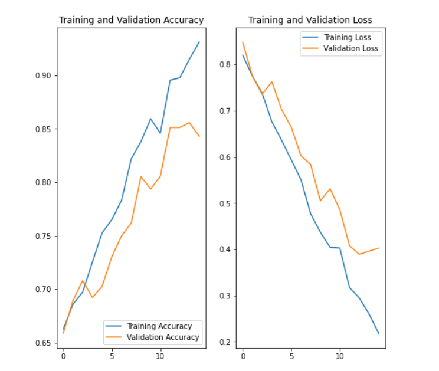

### 2.采用双服务器进行负载均衡

由于作为学生，经费有限，同时采用两台服务器进行部署项目，让项目有较高的响应速度

